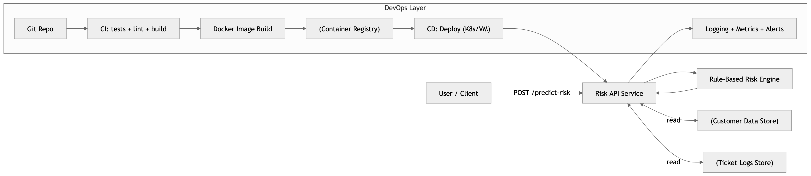
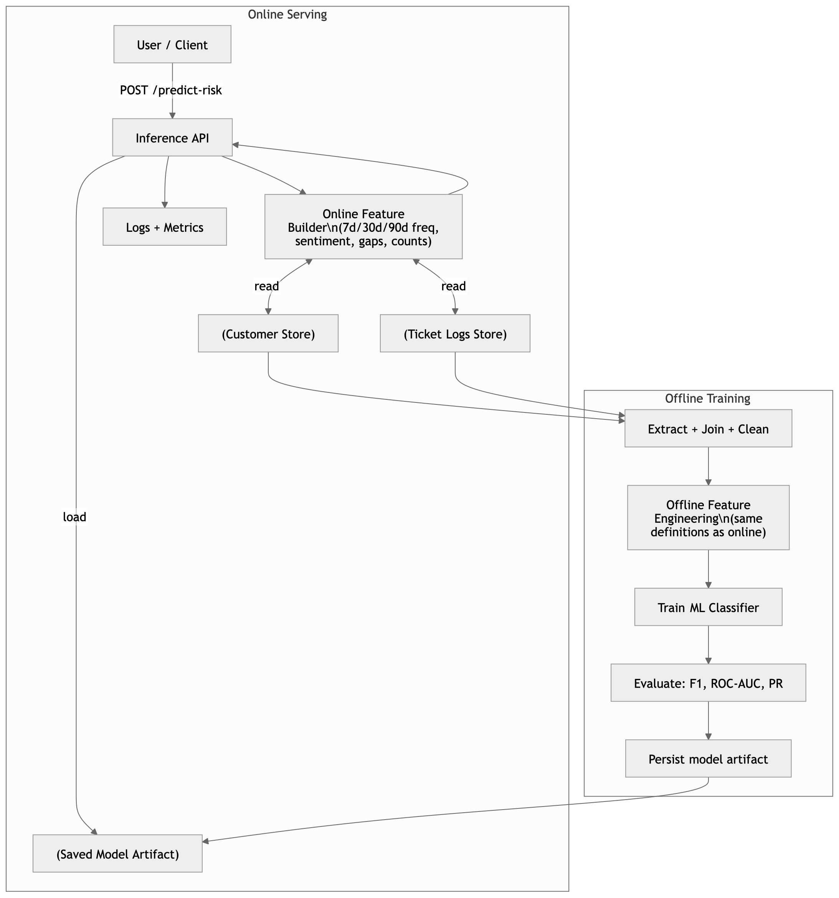
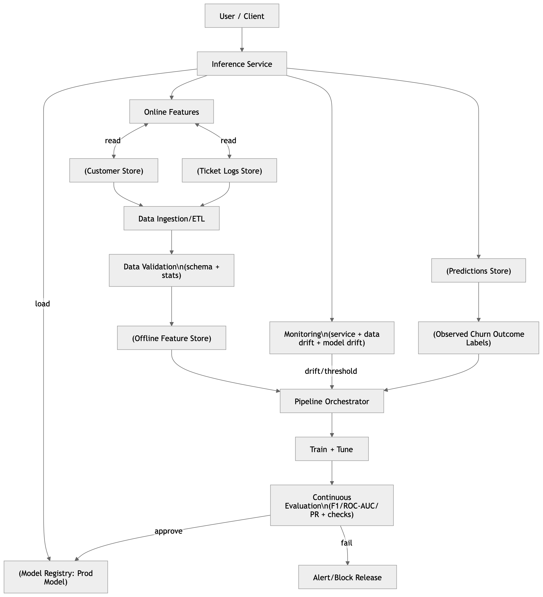

**Name:** Sree Vardhan Reddy Gujjala  
**Roll No:** 2022BCS0056  

# 1) DevOps Architecture (Rule-Based System) — corrected & detailed

## What the assignment expects
* Ingest customer + ticket data
* Rule-based churn risk engine
* REST API `/predict-risk`
* Dockerized + CI/CD + logging/monitoring + unit tests + API docs

## What’s good in your diagram
You correctly show “pure backend system, no training pipeline” and deterministic rule evaluation.

## What to fix/add (small but important)
* Explicitly show API service, data ingestion, data store, and observability as first-class components.
* CI/CD should publish an image to a registry before deployment (even if implied).
* Monitoring should cover API latency/errors (not only logs).

## Clean “DevOps-only” diagram (use this)

**Meaning (better wording):**
A deterministic backend service where churn risk is computed using fixed business rules on customer + ticket history. No training, no model artifacts—only standard DevOps lifecycle (build/test/deploy/monitor). This matches the “NO machine learning allowed” Stage-1 requirement.

---

# 2) ML Architecture (Model Introduced) — corrected & detailed

## What the assignment expects
* Replace rule engine with ML inference endpoint
* Feature engineering (ticket frequency, sentiment, category counts, etc.)
* Training script + saved model artifact
* Evaluation metrics: F1, ROC-AUC, Precision-Recall

## What’s good in your ML section
You correctly state: rule engine replaced by ML inference, and the system now includes feature engineering, training pipeline, model artifact, and metrics (F1/ROC-AUC/PR).

## What to fix/add (for correctness)
Right now, most student diagrams miss one key thing: offline training features must match online inference features. Add:
* Offline feature engineering (batch)
* Online feature builder (real-time)
* A single “feature definition” shared by both (conceptually)

Also add an explicit “model artifact store” (even if it’s just S3/local).

## Clean ML diagram (use this)

**Meaning (better wording):**
Rules are replaced by an ML classifier. The system now has a training workflow that produces a versioned model artifact, and a serving API that computes the same features at inference time and runs model prediction. Metrics like F1/ROC-AUC/PR validate quality before using the model.

---

# 3) MLOps Architecture (Production ML System) — corrected & detailed

## What you already captured correctly
You mention the core MLOps additions: model lifecycle management, data versioning, monitoring + retraining loops, continuous evaluation.
And your diagram shows monitoring/drift → retraining trigger → training pipeline → registry → deployment (good structure).

## What to fix/add (to make it “production-grade”)
Add these missing but standard production boxes:
* Model Registry (approved models, stages like Staging/Prod)
* Experiment tracking / metadata store (so you know what data/code produced a model)
* Data validation (schema, nulls, distribution checks) before training and before serving
* Feedback loop: store predictions + later churn outcomes (labels) for monitoring & retraining

## Clean MLOps diagram (use this)

**Meaning (better wording):**
A complete production ML system where data + features + models are versioned, model releases are gated by evaluation, the deployed model is monitored for drift and performance decay, and retraining is triggered based on monitoring signals or schedules, closing the loop from prediction → real outcomes → improved next model.

---

# Written Explanation — corrected & more detailed

### Q1) What broke when ML was added?
Your answer is correct directionally (data drift, feature mismatch, artifact confusion).
One precision fix: inference is usually deterministic for a fixed model, but the system behavior over time becomes data/model-version dependent.

**Improved answer:**
* **Reproducibility broke:** behavior now depends on data snapshot + feature code + labels + random seeds + model version, not just application code.
* **Debugging changed:** failures shift from clear code bugs to data quality issues and statistical behavior changes (label noise, leakage, drift).
* **Training/serving skew appeared:** features computed offline during training may differ from online inference → silent accuracy drop (you already mention feature mismatch).
* **New “invisible” failure mode:** performance can degrade without any code change (you already note silent degradation).

### Q2) Why DevOps alone is insufficient?
You correctly say DevOps assumes “code defines behavior” and “tests validate correctness,” and ML violates that because data drives behavior.

**Improved answer:**
DevOps covers deploying and operating services, but it does not manage:
* **Data lineage/versioning** (what exact data created this model?)
* **Experiment tracking** (which hyperparams/features won?)
* **Model validation gates** (ship only if F1/ROC-AUC/PR meet thresholds)
* **Continuous evaluation + drift monitoring** (model decay happens without deploys)

### Q3) What new risks ML introduces?
Your list is solid (bias, shift, drift, mismatch, non-repro, business false positives, overfitting). Add 2–3 high-impact risks that evaluators like:
* **Data leakage:** training accidentally uses future info → looks great offline, fails in production.
* **Fairness & compliance risk:** biased features can create unequal targeting or denial patterns.
* **Model supply-chain risk:** wrong artifact/version deployed, or insecure model artifact storage.

**Key shift (your conclusion is correct):** backend failures are binary, ML failures are gradual and invisible until metrics collapse.