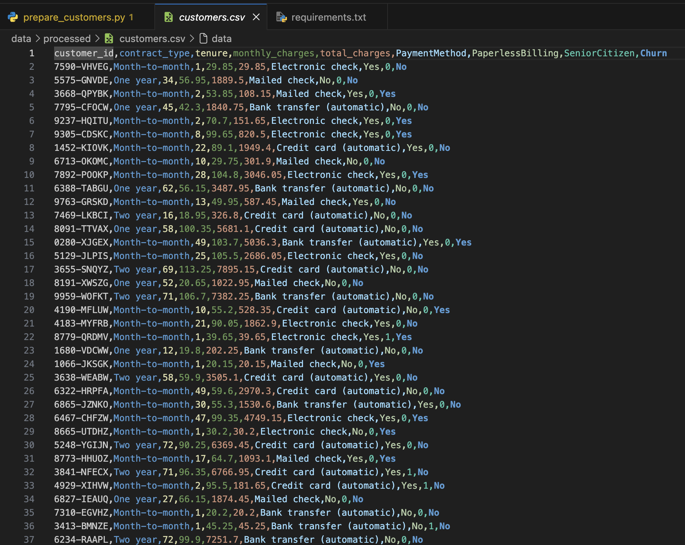
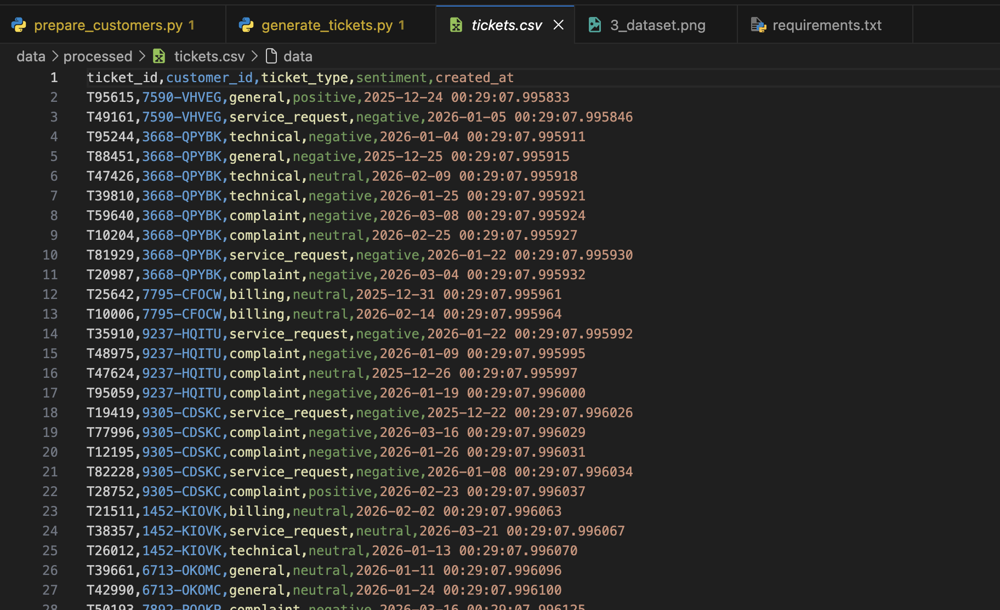

**Name:** Sree Vardhan Reddy Gujjala  
**Roll No:** 2022BCS0056  

# Phase 1: Data Preparation Layer

### Objective:
Establish a realistic and robust telecom backend data environment to feed our churn risk prediction system.

**Tasks:**
- Procure the Telco Customer Churn dataset.
- Clean and preprocess the dataset to extract relevant fields.
- Generate synthetic, behavior-based ticket logs for customers.
- Store the processed datasets for downstream consumption.

**Outputs:**
```text
data/
   processed/customers.csv
   processed/tickets.csv
```

**Key Data Attributes Extracted:**
- `customer_id`
- `contract_type`
- `monthly_charges`
- `tenure`
- `tickets_last_30_days`
- `complaint_ticket`

**Purpose:**
The rule engine (and later ML models) require clean, aggregated feature data rather than raw transactional logs.

---

## Step 00: Dataset Procurement

The base data utilized is the Telco Customer Churn dataset.


*Source: [Kaggle](https://www.kaggle.com/datasets/blastchar/telco-customer-churn/data).*

**Initial Directory Structure:**

```text
project-root/
│
├── data/
│   ├── raw/
│   │   └── telco_churn.csv 
│   └── processed/
│
├── scripts/
│   ├── prepare_customers.py
│   ├── generate_tickets.py
│   └── validate_tickets.py
│
├── src/
│
└── tests/
```

---

## Step 01: Initial Data Inspection

Before cleaning, we inspect the raw dataset to understand its structure.


The raw dataset contains 7043 rows and 21 columns representing various customer attributes and their churn status.

---

## Step 02: Data Cleaning and Feature Selection

We filter out irrelevant features to keep only what is necessary for our backend rule engine.

```python
# scripts/prepare_customers.py

import os
import pandas as pd

SCRIPT_DIR = os.path.dirname(os.path.abspath(__file__))
raw_data_path = os.path.join(SCRIPT_DIR, "../data/raw/telco_churn.csv")
processed_data_path = os.path.join(SCRIPT_DIR, "../data/processed/customers.csv")

df = pd.read_csv(raw_data_path)

# Handle numeric conversion issues
df["TotalCharges"] = pd.to_numeric(df["TotalCharges"], errors="coerce")
df = df.dropna(subset=["TotalCharges"])

# Standardize column names
df = df.rename(columns={
    "customerID": "customer_id",
    "Contract": "contract_type",
    "MonthlyCharges": "monthly_charges",
    "TotalCharges": "total_charges"
})

# Select essential features
columns_to_keep = [
    "customer_id", "contract_type", "tenure", "monthly_charges",
    "total_charges", "PaymentMethod", "PaperlessBilling",
    "SeniorCitizen", "Churn"
]

df = df[columns_to_keep]
df.to_csv(processed_data_path, index=False)

print("customers dataset saved")
```

**Execution:**


**Resulting Data:**



---

## Step 03: Defining the Ticket Log Schema

To simulate a real-world telecom support backend, we need synthetic ticket logs. We define the schema as follows:

- `ticket_id`: Unique identifier
- `customer_id`: Foreign key to the customers table
- `ticket_type`: Categorical (complaint, technical, billing, service_request, general)
- `sentiment`: Categorical (negative, neutral, positive)
- `created_at`: Timestamp

---

## Step 04: Conditional Synthetic Data Generation

Random ticket generation would hinder future ML models from learning actual patterns. We must employ **Conditional Simulation** based on churn status.

**Behavioral Heuristics:**
*   **Churned Customers:** Higher ticket volume (4-10), high probability of complaints, predominantly negative sentiment.
*   **Retained Customers:** Lower ticket volume (0-3), low probability of complaints, predominantly neutral/positive sentiment.

```python
# scripts/generate_tickets.py
import os
import pandas as pd
import random
from datetime import datetime, timedelta

SCRIPT_DIR = os.path.dirname(os.path.abspath(__file__))
customers_path = os.path.join(SCRIPT_DIR, "../data/processed/customers.csv")
tickets_path = os.path.join(SCRIPT_DIR, "../data/processed/tickets.csv")

customers = pd.read_csv(customers_path)

complaint_types = ["complaint"]
other_types = ["technical", "billing", "service_request", "general"]
tickets = []

for _, row in customers.iterrows():
    cid = row["customer_id"]
    churn = row["Churn"]

    # Apply conditional logic based on churn status
    if churn == "Yes":
        ticket_count = random.randint(4, 10)
        complaint_prob = 0.5
        negative_prob = 0.6
    else:
        ticket_count = random.randint(0, 3)
        complaint_prob = 0.1
        negative_prob = 0.2

    for _ in range(ticket_count):
        ticket_type = "complaint" if random.random() < complaint_prob else random.choice(other_types)
        sentiment = "negative" if random.random() < negative_prob else random.choice(["neutral", "positive"])
        
        tickets.append({
            "ticket_id": f"T{random.randint(10000, 99999)}",
            "customer_id": cid,
            "ticket_type": ticket_type,
            "sentiment": sentiment,
            "created_at": datetime.now() - timedelta(days=random.randint(1, 90))
        })

pd.DataFrame(tickets).to_csv(tickets_path, index=False)
```

**Generated Ticket Data:**



---

## Step 05: Data Validation and Sanity Checks

We must validate that our synthetic generation created the intended behavioral correlations without introducing data integrity issues.

**Validation Execution:**


### Key Analytical Inferences:

1.  **Referential Integrity Maintained:**
    *   No orphaned tickets exist; all tickets map to a valid `customer_id` from the cleaned dataset of 7032 records.
    *   Zero null values across all critical fields (`ticket_id`, `type`, `sentiment`).
2.  **Realistic Workload Distribution:**
    *   While complaints are the highest volume category, there is a healthy spread across technical, billing, and general inquiries, mimicking a realistic multi-tier support environment.
3.  **Distinct Behavioral Profiles (The Churn Signal):**
    *   **Volume:** Retained customers average ~1.5 tickets total, while churned customers average ~7 tickets.
    *   **Recency:** Churned customers show a severe spike in recent activity (averaging ~2.3 tickets in the last 30 days compared to ~0.5 for retained).
4.  **System Readiness:**
    *   The strong statistical divergence between cohorts confirms that our Rule Engine (and eventual ML models) will have high-quality, actionable signals to compute churn risk accurately.

---
**Status: Data Layer Successfully Finalized.** We possess clean customer profiles and relationally sound, behaviorally realistic ticket logs.