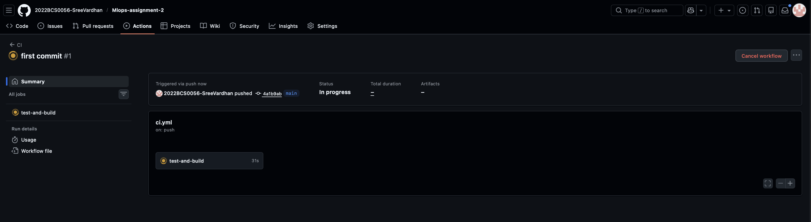
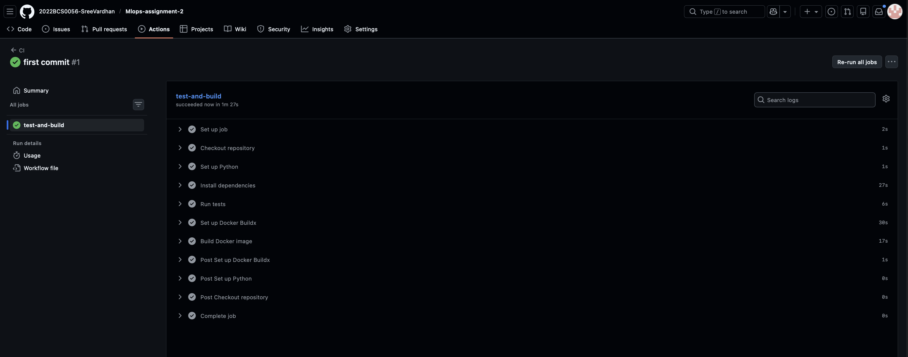
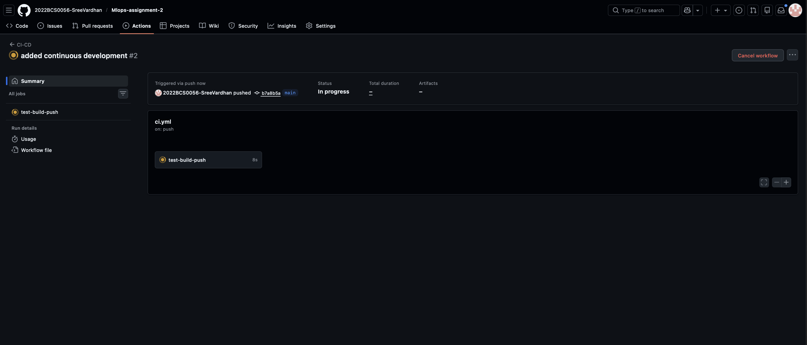
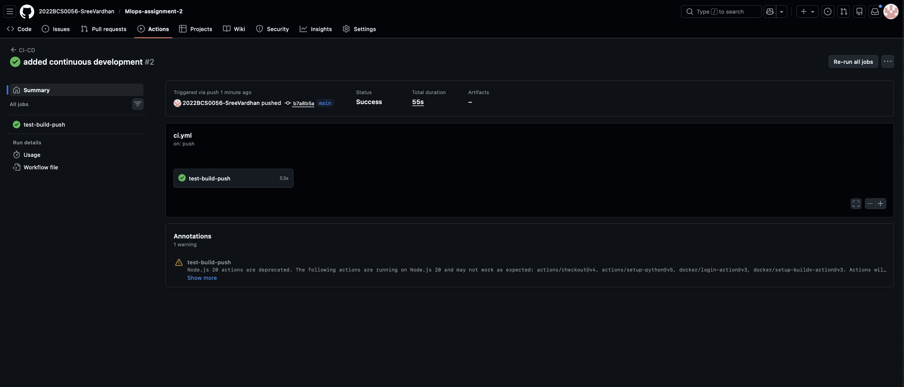
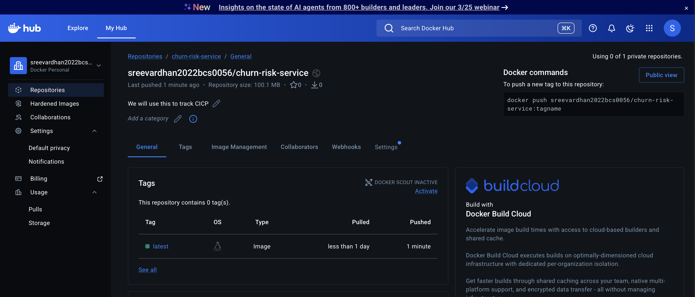
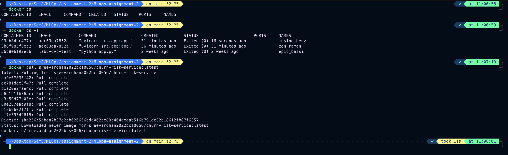
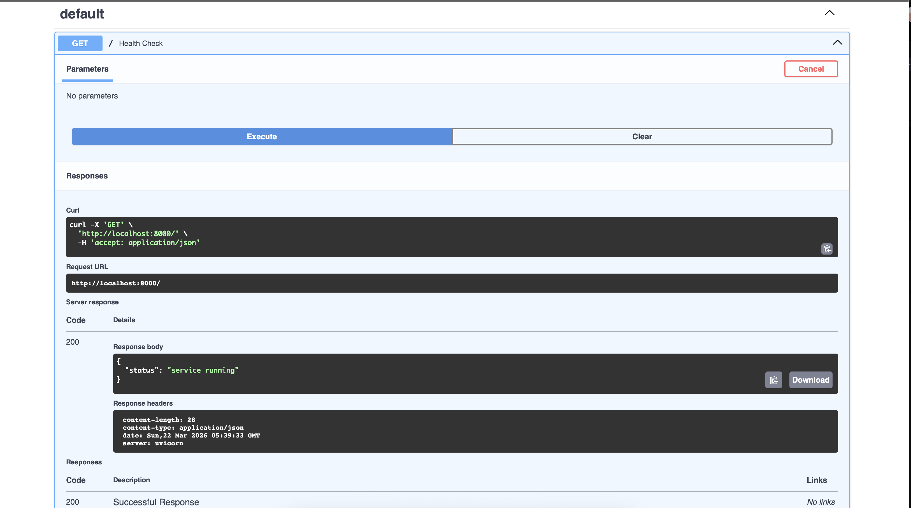
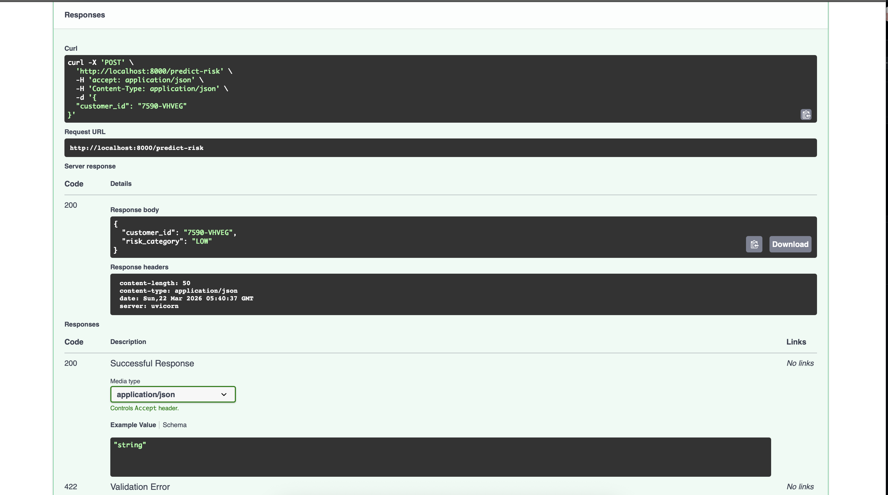
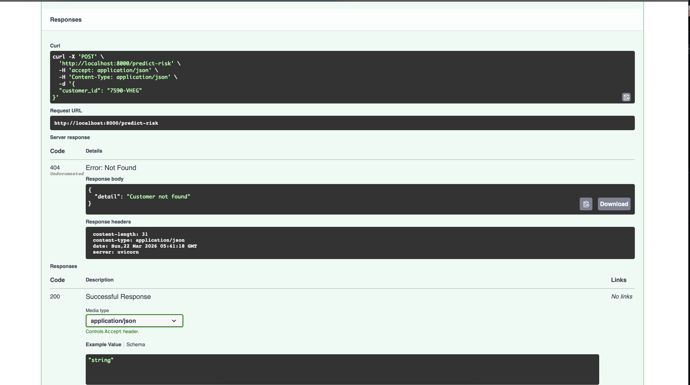
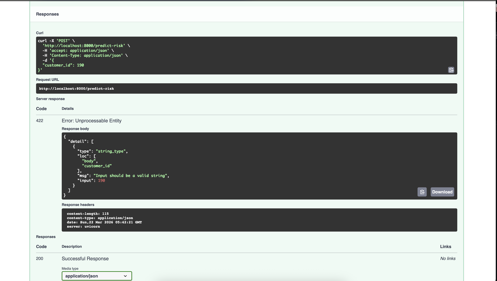

**Name:** Sree Vardhan Reddy Gujjala  
**Roll No:** 2022BCS0056  

# Phase 7: CI/CD Pipeline

## Objective

Automate the build, test, and deployment verification workflows using GitHub Actions to ensure code quality and seamless delivery.

**Tasks:**
- Implement Continuous Integration (CI) to run on code push.
- Define a CI pipeline with steps: clone, install, test, and build Docker image.
- Configure Continuous Deployment (CD) to push the verified Docker image to DockerHub.

**Technology:**
- GitHub Actions
- DockerHub

**Outputs:**
- Automated build verification
- Deployed Docker Image in DockerHub Registry

---

## Step 01: Setup GitHub Actions CI Workflow

We define a YAML workflow file to execute our CI pipeline every time code is pushed or a PR is made to the `main` branch. 

Create `.github/workflows/ci.yml`:

```yaml
name: CI

on:
  push:
    branches: [ "main" ]
  pull_request:
    branches: [ "main" ]

jobs:
  test-and-build:
    runs-on: ubuntu-latest

    steps:
      - name: Checkout repository
        uses: actions/checkout@v4

      - name: Set up Python
        uses: actions/setup-python@v5
        with:
          python-version: "3.12"

      - name: Install dependencies
        run: |
          python -m pip install --upgrade pip
          pip install -r requirements.txt

      - name: Run tests
        run: |
          pytest

      - name: Set up Docker Buildx
        uses: docker/setup-buildx-action@v3

      - name: Build Docker image
        run: |
          docker build -t churn-risk-service:ci .
```

If tests fail or the Docker build fails, the pipeline fails, preventing broken code from progressing.

---

## Step 02: Verify the CI Execution

Upon pushing the `.github/workflows/ci.yml` file to the repository, navigate to the **Actions** tab on GitHub.



*The workflow triggers automatically and is in progress.*



*The CI pipeline succeeds. We can expand the "Run tests" and "Build Docker image" steps to verify execution logs.*

---

## Step 03: Setup for the Continuous Deployment (CD) Phase

To push our built images to a registry, we need to set up DockerHub and connect it securely to GitHub.

**3A - Create DockerHub Repository:**
Log in to DockerHub and create a new public repository named `churn-risk-service`.


**3B & 3C - Configure GitHub Repository Secrets:**
1. Generate a Personal Access Token (PAT) in your DockerHub Account Settings.
   
2. In your GitHub repository, navigate to **Settings** → **Secrets and variables** → **Actions**.
3. Add two new repository secrets:
   - `DOCKERHUB_USERNAME`: Your DockerHub username.
   - `DOCKERHUB_TOKEN`: The PAT you just generated.
   

---

## Step 04: Update Pipeline for CI + CD

We update our workflow to include the deployment steps. If the tests pass and the image builds successfully, it will be tagged and pushed to DockerHub.

Update `.github/workflows/ci.yml` (or rename to `ci-cd.yml`):

```yaml
name: CI-CD

on:
  push:
    branches: [ "main" ]

jobs:
  test-build-push:
    runs-on: ubuntu-latest

    steps:
      - name: Checkout repository
        uses: actions/checkout@v4

      - name: Set up Python
        uses: actions/setup-python@v5
        with:
          python-version: "3.12"

      - name: Install dependencies
        run: |
          python -m pip install --upgrade pip
          pip install -r requirements.txt

      - name: Run tests
        run: |
          pytest

      - name: Set up Docker Buildx
        uses: docker/setup-buildx-action@v3

      - name: Login to DockerHub
        uses: docker/login-action@v3
        with:
          username: ${{ secrets.DOCKERHUB_USERNAME }}
          password: ${{ secrets.DOCKERHUB_TOKEN }}

      - name: Build and Push Docker Image
        run: |
          docker build -t ${{ secrets.DOCKERHUB_USERNAME }}/churn-risk-service:latest .
          docker push ${{ secrets.DOCKERHUB_USERNAME }}/churn-risk-service:latest
```

---

## Step 05: Verify CI + CD Integration

Commit and push the updated workflow.



*The new CI-CD pipeline is executing.*



*Pipeline execution is successful, including the push to DockerHub.*

**Verify on DockerHub:**
Check your DockerHub repository to confirm the `latest` tag was pushed.


---

## Step 06: Local Verification of Deployed Image

To ensure the deployed image works flawlessly, we pull it from DockerHub and run it locally.

```bash
docker pull <your-dockerhub-username>/churn-risk-service:latest
docker run -p 8000:8000 <your-dockerhub-username>/churn-risk-service:latest
```



Test the endpoints to confirm the service is fully operational:

1. **Health Check:**
   

2. **Valid POST Request:**
   

3. **Invalid Customer (404):**
   

4. **Invalid Input Validation (422):**
   

**Conclusion:**
The CI/CD pipeline is fully operational. It automatically tests our code, builds an isolated container, and publishes it for deployment. We have verified the artifact by pulling and testing it locally.